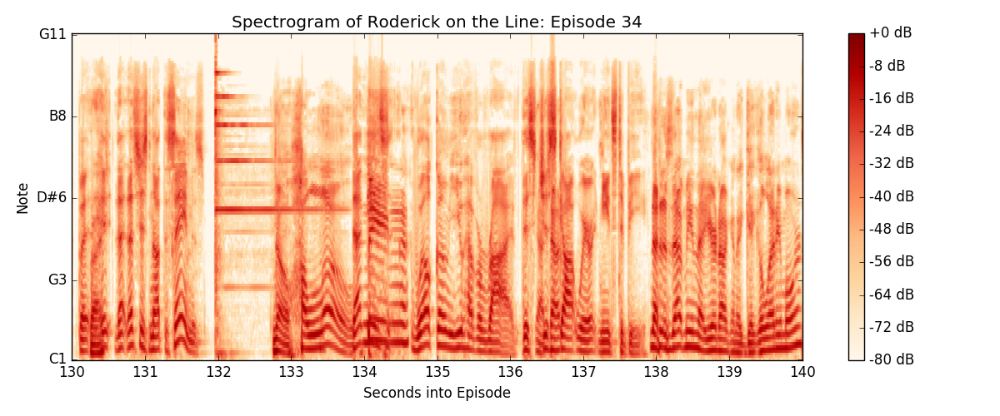
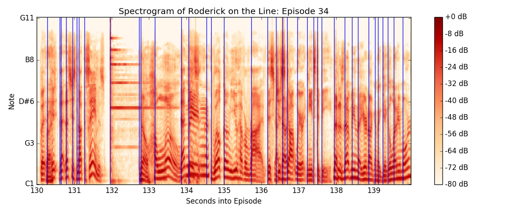

# "Roderick on the Line" Bell Detector
*** WIP *** 

<h1>Description</h1>

The "Roderick on the Line" Bell Detector finds every time a bell has been rung in a corpus of podcast episodes and saves extracts of the audio. 

"Roderick on the Line" is a podcast, self-described as  "Merlin Mann’s frank & candid weekly call with John Roderick of The Long Winters." http://roderickontheline.com/

Starting in Episode 34, "A Shit Barge Full of Long Pigs", Merlin started ringing a desk bell when John said something particularly funny or noteworthy, as well as to indicate the end of an episode. 

My goal with this project is to build a supercut of every bell ring. 

<h1>Methodology</h1>

A spectrogram is a visual representation of a sound. Here's a spectrogram of the first appearance of the bell in Episode 34: 

The vertical line at 132 seconds is Merlin's hand hitting the bell and the horizontal lines to the right represent the bell's ring. Bells ring at several harmonic frequencies (for more background, I highly recommend [Wikipedia's article on bells](https://en.wikipedia.org/wiki/Bell#Tuning)). 

Using the Librosa package's (onset detector)[http://bmcfee.github.io/librosa/generated/librosa.onset.onset_detect.html?highlight=onset_detection], we can split the sound up into small chunks of time after each onset. The blue lines in this spectrogram are the detected onsets: 

For inputs to my classifier, I used the spectrograms of the small chunks of time after each onset. 

<h1>Directory Structure</h1>

RotL episodes should be downloaded and saved to the "episodes" directory in the format "rotl_0000.mp3" (where 0000 is the zero-padded episode number).

Found bells will be saved to the "found_bells" directory, which the script will create. 

<h1>Known Issues</h1>

The logistic regression isn't working great. Many false positives are being detected, especially Merlin's singsongy laugh and both hosts' musical interjections. I plan to try other pattern detection algrorithms, and try different methods of extracting features. 

Also, I found that ffmpeg is far faster than librosa at reading and writing audio files (important when the corpus runs to 243 hours of audio) but I keep running into a bug where ffmpeg can't find files. 

<h1>Roderick on the Line Stats</h1>

(through Episode 184)

Total length:
* Total RotL seconds: 875,690
* Total RotL minutes: 14,595
* Total RotL hours: 243
* Total RotL days: 10.14
* Total RotL weeks: 1.45

Typical and atypical episodes: 
* Average RotL length in minutes: 78.9
* Minimum RotL length in minutes: 51.0, Ep. 147: "The Om of Surrender"
* Maximum RotL length in minutes: 119.9, Ep. 183: "Here Comes Nacho"
